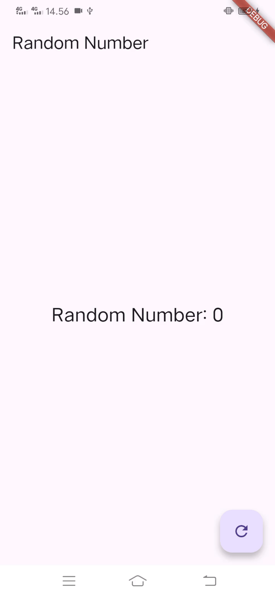

# Tugas Flutter Lanjutan State Management dengan Stream menggunakan Bloc Pattern

Mohamad Juan Adi Pratama - 1122140109

## Deskripsi Proyek

Proyek Flutter yang mendemonstrasikan state management dengan Bloc Pattern.

## Laporan Praktikum

### Soal no 13

#### Penjelasan Praktikum Random Number Generator dengan BLoC Pattern

Praktikum ini bertujuan untuk mendemonstrasikan implementasi pola BLoC (Business Logic Component) dalam aplikasi Flutter sederhana yang menghasilkan angka acak. Pola BLoC adalah salah satu pendekatan arsitektur yang memisahkan logika bisnis dari lapisan presentasi (UI).

#### Tujuan Praktikum
- Mengenalkan pola arsitektur BLoC
- Memahami konsep Stream dan StreamController di Dart
- Menunjukkan pemisahan UI dan logika bisnis
- Implementasi komunikasi antara UI dan BLoC melalui Stream

#### Letak Konsep Pola BLoC

Konsep pola BLoC dalam praktikum ini terdapat pada:

1. **Class `RandomNumberBloc`** (`random_bloc.dart`):
   - Bertugas menangani logika bisnis (menghasilkan angka acak)
   - Mengelola Stream dan StreamController
   - Menyediakan metode untuk komunikasi dengan UI

2. **Pemisahan komponen**:
   - `RandomNumberBloc` (logika bisnis) terpisah dari `RandomScreen` (UI)
   - UI hanya berinteraksi dengan BLoC melalui Stream dan Sink

3. **Aliran data unidirectional (aliran data satu arah)**:
   - Input: Melalui `generateRandom` Sink (`_bloc.generateRandom.add(null)`)
   - Output: Melalui `randomNumber` Stream yang digunakan dalam `StreamBuilder`

4. **Komponen BLoC yang khas**:
   - `StreamController` untuk mengelola aliran data
   - Metode `dispose()` untuk membersihkan resource
   - API publik berupa getter untuk Stream dan Sink

5. **Implementasi di UI**:
   - `StreamBuilder` digunakan untuk mendengarkan perubahan dari BLoC
   - UI hanya fokus pada presentasi dan mengirim event ke BLoC

Pola BLoC menggunakan Stream sebagai cara untuk berkomunikasi antara logika bisnis dan UI, sehingga membuat kode lebih terstruktur, lebih mudah diuji, dan mempermudah pengelolaan state aplikasi.

#### Demo

